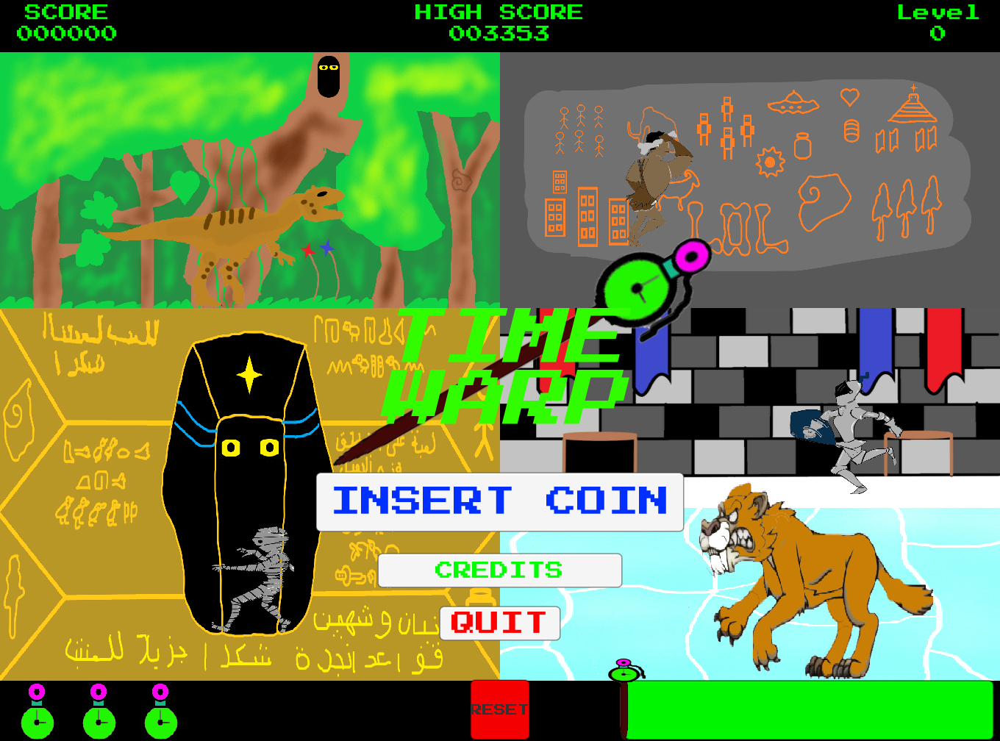

# Time Warp

This is a simple arcade-style game that was created using Unity.
The game was a video game design submission for TSA Georgia State Conference 2022.

The game sees a person, the user, who has activated a time portal and now must run through different time periods 
to make it back to the museum. 

### How to Play

Go to: https://play.unity.com/en/games/0d365c13-35c9-4c41-a429-9b031b4e325c/time-warp

- Use A and D to move left and right
- W to jump
- Spacebar to freeze the enemy 
- Press ESC to pause the game

The game was rushed to reach early deadlines, and thus has several bugs. However, these bugs 
do not occur often nor get in the way of gameplay from start to finish.